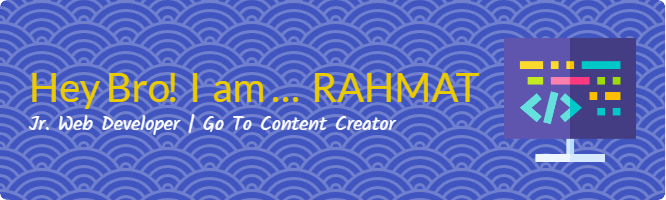

# 👨‍💻 Hi there, I'm [Rahmat]!

🌱 I’m a **Junior Programmer** who’s passionate about learning and building projects using modern technologies.

---

## 🔧 Tech Stack

- 💻 Languages: `JavaScript`, `PHP`, `HTML`, `CSS`
- ⚙️ Frameworks: `Laravel`, `Tailwind CSS`, `Bootstrap`, `React (Basic)`.
- 🛠️ Tools: `Git`, `VS Code`, `Postman`, `XAMPP`, `Composer`
- 🗄️ Databases: `MySQL`, `SQLite`

---

## 🚀 Projects I'm Working On

- 🧺 **Laundry App** — Laravel + Filament + Tailwind CSS
- 📦 **Inventory System Mosque** — Web-based inventory using PHP & Bootstrap
- 🎮 **Landing Page Company** — Simple browser game using vanilla JS

---

## Skills

### Database

### Editing

### Front End

### Back End

## 📈 GitHub Stats

---

## 🤝 Let's Connect!

- 💼 LinkedIn: [linkedin.com/in/rahmat](https://www.linkedin.com/in/rahmat-hidayat-45702a1bb/)
- 🌐 Portfolio: [yourdomain.com](https://yourdomain.com)
- 📫 Email: rahmat_17@mhs.akba.ac.id

---

## 🧠 Fun Facts About Me

- 🐱 I love debugging more than coding (sometimes 😉)
- 📚 Currently learning `Laravel` & `TailwindCss`
- ☕ Fueled by coffee and curiosity

---

> "The best way to learn is by doing. Never stop building." – 🧑‍💻
